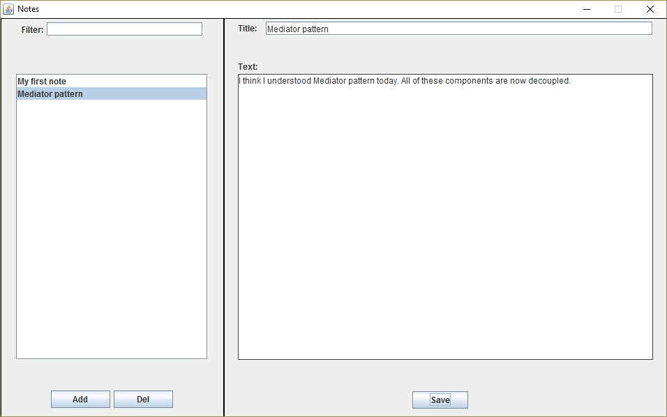

## Mediator in Java

> **Mediator** is a behavioral design pattern that reduces coupling between components of a program by making them communicate indirectly, through a special mediator object.

The Mediator makes it easy to modify, extend and reuse individual components because they’re no longer dependent on the dozens of other classes.

---

### Usage of the pattern in Java

**Usage examples**: The most popular usage of the Mediator pattern in Java code is facilitating communications between GUI components of an app. The synonym of the Mediator is the Controller part of MVC pattern.

Here are some examples of the pattern in core Java libraries:

- **java.util.Timer** (all scheduleXXX() methods)
- **java.util.concurrent.Executor#execute()**
- **java.util.concurrent.ExecutorService** (invokeXXX() and submit() methods)
- **java.util.concurrent.ScheduledExecutorService** (all scheduleXXX() methods)
- **java.lang.reflect.Method#invoke()**

## Notes app

This example shows how to organize lots of GUI elements so that they cooperate with the help of a mediator but don’t depend on each other.


#### components/Component.java

```java
package design_patterns.mediator.example.components;

import design_patterns.mediator.example.mediator.Mediator;

/**
 * Common component interface.
 */
public interface Component {
    void setMediator(Mediator mediator);
    String getName();
}
```


#### components/AddButton.java

```java
package design_patterns.mediator.example.components;

import design_patterns.mediator.example.mediator.Mediator;
import design_patterns.mediator.example.mediator.Note;

import javax.swing.*;
import java.awt.event.ActionEvent;

/**
 * Concrete components don't talk with each other. They have only one
 * communication channel–sending requests to the mediator.
 */
public class AddButton extends JButton implements Component {
    private Mediator mediator;

    public AddButton() {
        super("Add");
    }

    @Override
    public void setMediator(Mediator mediator) {
        this.mediator = mediator;
    }

    @Override
    protected void fireActionPerformed(ActionEvent actionEvent) {
        mediator.addNewNote(new Note());
    }

    @Override
    public String getName() {
        return "AddButton";
    }
}
```


#### components/DeleteButton.java

```java
package design_patterns.mediator.example.components;

import design_patterns.mediator.example.mediator.Mediator;

import javax.swing.*;
import java.awt.event.ActionEvent;

/**
 * Concrete components don't talk with each other. They have only one
 * communication channel–sending requests to the mediator.
 */
public class DeleteButton extends JButton  implements Component {
    private Mediator mediator;

    public DeleteButton() {
        super("Del");
    }

    @Override
    public void setMediator(Mediator mediator) {
        this.mediator = mediator;
    }

    @Override
    protected void fireActionPerformed(ActionEvent actionEvent) {
        mediator.deleteNote();
    }

    @Override
    public String getName() {
        return "DelButton";
    }
}
```


#### components/Filter.java

```java
package design_patterns.mediator.example.components;

import design_patterns.mediator.example.mediator.Mediator;
import design_patterns.mediator.example.mediator.Note;

import javax.swing.*;
import java.awt.event.KeyEvent;
import java.util.ArrayList;

/**
 * Concrete components don't talk with each other. They have only one
 * communication channel–sending requests to the mediator.
 */
public class Filter extends JTextField implements Component {
    private Mediator mediator;
    private ListModel listModel;

    public Filter() {}

    @Override
    public void setMediator(Mediator mediator) {
        this.mediator = mediator;
    }

    @Override
    protected void processComponentKeyEvent(KeyEvent keyEvent) {
        String start = getText();
        searchElements(start);
    }

    public void setList(ListModel listModel) {
        this.listModel = listModel;
    }

    private void searchElements(String s) {
        if (listModel == null) {
            return;
        }

        if (s.equals("")) {
            mediator.setElementsList(listModel);
            return;
        }

        ArrayList<Note> notes = new ArrayList<>();
        for (int i = 0; i < listModel.getSize(); i++) {
            notes.add((Note) listModel.getElementAt(i));
        }
        DefaultListModel<Note> listModel = new DefaultListModel<>();
        for (Note note : notes) {
            if (note.getName().contains(s)) {
                listModel.addElement(note);
            }
        }
        mediator.setElementsList(listModel);
    }

    @Override
    public String getName() {
        return "Filter";
    }
}
```


#### components/List.java

```java
package design_patterns.mediator.example.components;

import design_patterns.mediator.example.mediator.Mediator;
import design_patterns.mediator.example.mediator.Note;

import javax.swing.*;

/**
 * Concrete components don't talk with each other. They have only one
 * communication channel–sending requests to the mediator.
 */
@SuppressWarnings("unchecked")
public class List extends JList implements Component {
    private Mediator mediator;
    private final DefaultListModel LIST_MODEL;

    public List(DefaultListModel listModel) {
        super(listModel);
        this.LIST_MODEL = listModel;
        setModel(listModel);
        this.setLayoutOrientation(JList.VERTICAL);
        Thread thread = new Thread(new Hide(this));
        thread.start();
    }

    @Override
    public void setMediator(Mediator mediator) {
        this.mediator = mediator;
    }

    public void addElement(Note note) {
        LIST_MODEL.addElement(note);
        int index = LIST_MODEL.size() - 1;
        setSelectedIndex(index);
        ensureIndexIsVisible(index);
        mediator.sendToFilter(LIST_MODEL);
    }

    public void deleteElement() {
        int index = this.getSelectedIndex();
        try {
            LIST_MODEL.remove(index);
            mediator.sendToFilter(LIST_MODEL);
        } catch (ArrayIndexOutOfBoundsException ignored) {}
    }

    public Note getCurrentElement() {
        return (Note)getSelectedValue();
    }

    @Override
    public String getName() {
        return "List";
    }

    private class Hide implements Runnable {
        private List list;

        Hide(List list) {
            this.list = list;
        }

        @Override
        public void run() {
            while (true) {
                try {
                    Thread.sleep(300);
                } catch (InterruptedException ex) {
                    ex.printStackTrace();
                }
                if (list.isSelectionEmpty()) {
                    mediator.hideElements(true);
                } else {
                    mediator.hideElements(false);
                }
            }
        }
    }
}
```


#### components/SaveButton.java

```java
package design_patterns.mediator.example.components;

import design_patterns.mediator.example.mediator.Mediator;

import javax.swing.*;
import java.awt.event.ActionEvent;

/**
 * Concrete components don't talk with each other. They have only one
 * communication channel–sending requests to the mediator.
 */
public class SaveButton extends JButton implements Component {
    private Mediator mediator;

    public SaveButton() {
        super("Save");
    }

    @Override
    public void setMediator(Mediator mediator) {
        this.mediator = mediator;
    }

    @Override
    protected void fireActionPerformed(ActionEvent actionEvent) {
        mediator.saveChanges();
    }

    @Override
    public String getName() {
        return "SaveButton";
    }
}
```


#### components/TextBox.java

```java
package design_patterns.mediator.example.components;

import design_patterns.mediator.example.mediator.Mediator;

import javax.swing.*;
import java.awt.event.KeyEvent;

/**
 * Concrete components don't talk with each other. They have only one
 * communication channel–sending requests to the mediator.
 */
public class TextBox extends JTextArea implements Component {
    private Mediator mediator;

    @Override
    public void setMediator(Mediator mediator) {
        this.mediator = mediator;
    }

    @Override
    protected void processComponentKeyEvent(KeyEvent keyEvent) {
        mediator.markNote();
    }

    @Override
    public String getName() {
        return "TextBox";
    }
}
```


#### components/Title.java

```java

package design_patterns.mediator.example.components;

import design_patterns.mediator.example.mediator.Mediator;

import javax.swing.*;
import java.awt.event.KeyEvent;

/**
 * Concrete components don't talk with each other. They have only one
 * communication channel–sending requests to the mediator.
 */
public class Title extends JTextField implements Component {
    private Mediator mediator;

    @Override
    public void setMediator(Mediator mediator) {
        this.mediator = mediator;
    }

    @Override
    protected void processComponentKeyEvent(KeyEvent keyEvent) {
        mediator.markNote();
    }

    @Override
    public String getName() {
        return "Title";
    }
}
```


#### mediator/Mediator.java: Defines common mediator interface

```java
package design_patterns.mediator.example.mediator;

import design_patterns.mediator.example.components.Component;

import javax.swing.*;

/**
 * Common mediator interface.
 */
public interface Mediator {
    void addNewNote(Note note);
    void deleteNote();
    void getInfoFromList(Note note);
    void saveChanges();
    void markNote();
    void clear();
    void sendToFilter(ListModel listModel);
    void setElementsList(ListModel list);
    void registerComponent(Component component);
    void hideElements(boolean flag);
    void createGUI();
}
```


#### mediator/Editor.java: Concrete mediator

```java
package design_patterns.mediator.example.mediator;

import design_patterns.mediator.example.components.*;
import design_patterns.mediator.example.components.Component;
import design_patterns.mediator.example.components.List;

import javax.swing.*;
import javax.swing.border.LineBorder;
import java.awt.*;

/**
 * Concrete mediator. All chaotic communications between concrete components
 * have been extracted to the mediator. Now components only talk with the
 * mediator, which knows who has to handle a request.
 */
public class Editor implements Mediator {
    private Title title;
    private TextBox textBox;
    private AddButton add;
    private DeleteButton del;
    private SaveButton save;
    private List list;
    private Filter filter;

    private JLabel titleLabel = new JLabel("Title:");
    private JLabel textLabel = new JLabel("Text:");
    private JLabel label = new JLabel("Add or select existing note to proceed...");
  
    /**
     * Here the registration of components by the mediator.
     */
    @Override
    public void registerComponent(Component component) {
        component.setMediator(this);
        switch (component.getName()) {
            case "AddButton":
                add = (AddButton)component;
                break;
            case "DelButton":
                del = (DeleteButton)component;
                break;
            case "Filter":
                filter = (Filter)component;
                break;
            case "List":
                list = (List)component;
                this.list.addListSelectionListener(listSelectionEvent -> {
                    Note note = (Note)list.getSelectedValue();
                    if (note != null) {
                        getInfoFromList(note);
                    } else {
                        clear();
                    }
                });
                break;
            case "SaveButton":
                save = (SaveButton)component;
                break;
            case "TextBox":
                textBox = (TextBox)component;
                break;
            case "Title":
                title = (Title)component;
                break;
        }
    }

    /**
     * Various methods to handle requests from particular components.
     */
    @Override
    public void addNewNote(Note note) {
        title.setText("");
        textBox.setText("");
        list.addElement(note);
    }

    @Override
    public void deleteNote() {
        list.deleteElement();
    }

    @Override
    public void getInfoFromList(Note note) {
        title.setText(note.getName().replace('*', ' '));
        textBox.setText(note.getText());
    }

    @Override
    public void saveChanges() {
        try {
            Note note = (Note) list.getSelectedValue();
            note.setName(title.getText());
            note.setText(textBox.getText());
            list.repaint();
        } catch (NullPointerException ignored) {}
    }

    @Override
    public void markNote() {
        try {
            Note note = list.getCurrentElement();
            String name = note.getName();
            if (!name.endsWith("*")) {
                note.setName(note.getName() + "*");
            }
            list.repaint();
        } catch (NullPointerException ignored) {}
    }

    @Override
    public void clear() {
        title.setText("");
        textBox.setText("");
    }

    @Override
    public void sendToFilter(ListModel listModel) {
        filter.setList(listModel);
    }

    @SuppressWarnings("unchecked")
    @Override
    public void setElementsList(ListModel list) {
        this.list.setModel(list);
        this.list.repaint();
    }

    @Override
    public void hideElements(boolean flag) {
        titleLabel.setVisible(!flag);
        textLabel.setVisible(!flag);
        title.setVisible(!flag);
        textBox.setVisible(!flag);
        save.setVisible(!flag);
        label.setVisible(flag);
    }

    @Override
    public void createGUI() {
        JFrame notes = new JFrame("Notes");
        notes.setSize(960, 600);
        notes.setDefaultCloseOperation(WindowConstants.EXIT_ON_CLOSE);
        JPanel left = new JPanel();
        left.setBorder(new LineBorder(Color.BLACK));
        left.setSize(320, 600);
        left.setLayout(new BoxLayout(left, BoxLayout.Y_AXIS));
        JPanel filterPanel = new JPanel();
        filterPanel.add(new JLabel("Filter:"));
        filter.setColumns(20);
        filterPanel.add(filter);
        filterPanel.setPreferredSize(new Dimension(280, 40));
        JPanel listPanel = new JPanel();
        list.setFixedCellWidth(260);
        listPanel.setSize(320, 470);
        JScrollPane scrollPane = new JScrollPane(list);
        scrollPane.setPreferredSize(new Dimension(275, 410));
        listPanel.add(scrollPane);
        JPanel buttonPanel = new JPanel();
        add.setPreferredSize(new Dimension(85, 25));
        buttonPanel.add(add);
        del.setPreferredSize(new Dimension(85, 25));
        buttonPanel.add(del);
        buttonPanel.setLayout(new FlowLayout());
        left.add(filterPanel);
        left.add(listPanel);
        left.add(buttonPanel);
        JPanel right = new JPanel();
        right.setLayout(null);
        right.setSize(640, 600);
        right.setLocation(320, 0);
        right.setBorder(new LineBorder(Color.BLACK));
        titleLabel.setBounds(20, 4, 50, 20);
        title.setBounds(60, 5, 555, 20);
        textLabel.setBounds(20, 4, 50, 130);
        textBox.setBorder(new LineBorder(Color.DARK_GRAY));
        textBox.setBounds(20, 80, 595, 410);
        save.setBounds(270, 535, 80, 25);
        label.setFont(new Font("Verdana", Font.PLAIN, 22));
        label.setBounds(100, 240, 500, 100);
        right.add(label);
        right.add(titleLabel);
        right.add(title);
        right.add(textLabel);
        right.add(textBox);
        right.add(save);
        notes.setLayout(null);
        notes.getContentPane().add(left);
        notes.getContentPane().add(right);
        notes.setResizable(false);
        notes.setLocationRelativeTo(null);
        notes.setVisible(true);
    }
}
```


#### mediator/Note.java: A note’s class

```java
package design_patterns.mediator.example.mediator;

/**
 * Note class.
 */
public class Note {
    private String name;
    private String text;

    public Note() {
        name = "New note";
    }

    public void setName(String name) {
        this.name = name;
    }

    public void setText(String text) {
        this.text = text;
    }

    public String getName() {
        return name;
    }

    public String getText() {
        return text;
    }

    @Override
    public String toString() {
        return name;
    }
}
```


#### Demo.java: Initialization code

```java
package design_patterns.mediator.example;

import design_patterns.mediator.example.components.*;
import design_patterns.mediator.example.mediator.Editor;
import design_patterns.mediator.example.mediator.Mediator;

import javax.swing.*;

/**
 * Demo class. Everything comes together here.
 */
public class Demo {
    public static void main(String[] args) {
        Mediator mediator = new Editor();

        mediator.registerComponent(new Title());
        mediator.registerComponent(new TextBox());
        mediator.registerComponent(new AddButton());
        mediator.registerComponent(new DeleteButton());
        mediator.registerComponent(new SaveButton());
        mediator.registerComponent(new List(new DefaultListModel()));
        mediator.registerComponent(new Filter());

        mediator.createGUI();
    }
}
```

#### OutputDemo.png: Execution result


